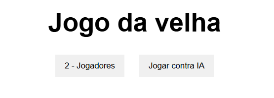
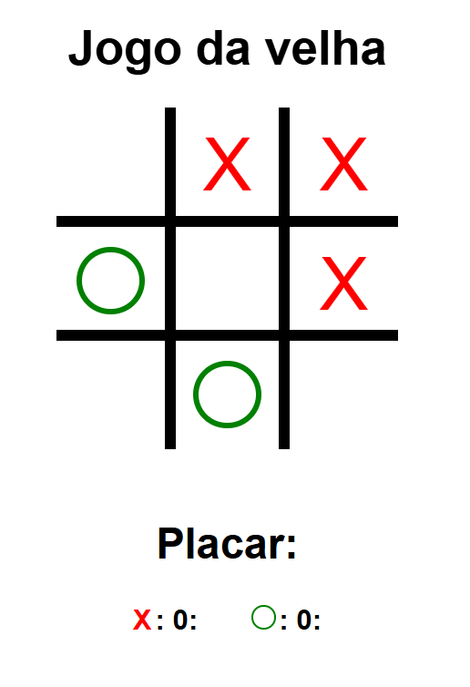
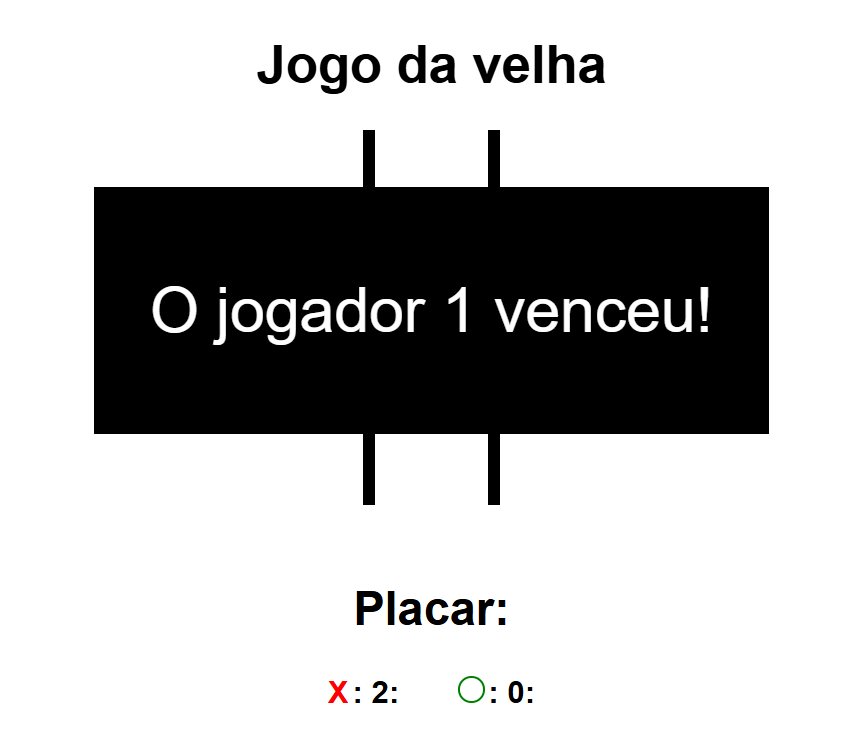

# Jogo da Velha

## Introdução

Este projeto é uma versão interativa e simples do clássico **Jogo da Velha**. O jogo pode ser jogado por **dois jogadores** ou contra um **oponente de IA**, oferecendo uma experiência de jogo completa diretamente no navegador. O objetivo é ser o primeiro a conseguir três de suas marcas (X ou O) em uma linha, coluna ou diagonal.

🔗 Acesse o projeto online   
https://guiihsantos.github.io/Jogo-Da-Velha/

## 💻 Funcionalidades do Jogo

- **Modos de Jogo**: Você pode escolher jogar contra outro jogador (2 players) ou contra a inteligência artificial (IA).
- **Como Jogar**:
  - Ao iniciar o jogo, clique em um dos botões para escolher o modo de jogo.
  - O jogador 1 (símbolo X) começa a partida.
  - Clique em qualquer um dos nove quadrados vazios para fazer sua jogada.
  - O jogo alterna entre os jogadores X e O a cada rodada.
  - O primeiro jogador a alinhar três de suas marcas horizontalmente, verticalmente ou diagonalmente vence.
- **Placar**: O placar no topo da tela registra as vitórias de cada jogador.
- **Reinício Automático**: Após cada vitória ou empate, o jogo se reinicia automaticamente para uma nova rodada, permitindo que você jogue continuamente.
- **Mensagens**: Mensagens claras na tela informam quem venceu a rodada ou se houve um empate ("Deu Velha!").

## 📦 Tecnologias usadas:

- 
- 
- 

## 📷 Imagem

 

    
    
    
  

  
## 🪪 Licença

Este projeto está licenciado sob a **Licença MIT**. Você pode usar, copiar, modificar, e distribuir este código para fins educacionais e não comerciais, desde que a atribuição original seja mantida.
